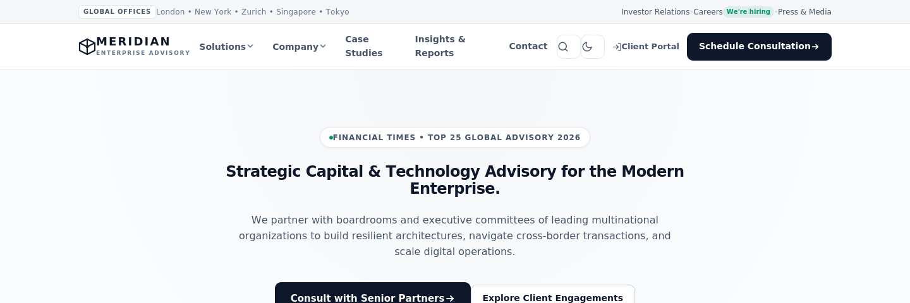
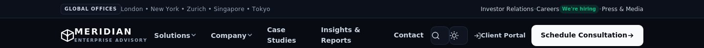
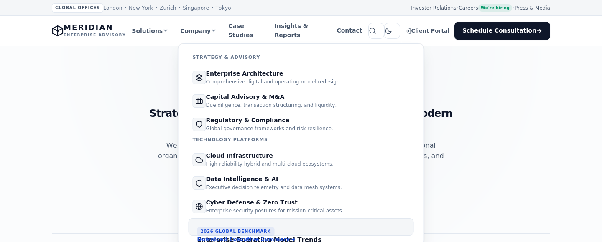

# Meridian — Corporate & Enterprise Navigation System

A human-crafted, executive-tier navigation system built for company profiles, advisory firms, institutional portals, and global enterprises. Designed to deliberately avoid generic "AI slop" clichés, it offers clear information architecture, structured multi-column mega-menus, dual light/dark themes, and complete WCAG accessibility. Part of the **Modern Navbar Collection**.


---

## 🖼️ Spotlight Preview

Lihat sekilas seperti apa Meridian sebelum membuka versi live-nya:

**Corporate Light theme — hero + top utility bar**



**Executive Dark theme — header close-up**



**Mega-menu terbuka — Solutions**



> Screenshot diambil langsung dari `index.html` di folder ini. Untuk melihat theme switcher, search overlay, dan mobile drawer secara langsung, buka versi live di bawah.

---

## 🔴 Live Demo

▶️ **[Lihat Meridian secara live](https://meridian-corporate-navbar.netlify.app)**

> Ganti URL di atas dengan link GitHub Pages proyekmu setelah repo di-deploy (Settings → Pages → pilih branch). Sebelum itu, kamu tetap bisa mencobanya secara lokal lewat `open index.html`.

---

## ✨ Features

| Feature | Details |
|---|---|
| **Human-Crafted Executive Design** | Avoids overused AI neon/cyberpunk cliches. Utilizes refined typography (*Plus Jakarta Sans*), subtle elevation shadows, and clean hairline borders. |
| **Multi-Column Mega-Menu** | Structured into Strategy & Advisory, Technology Platforms, and a Featured Benchmark report card with hover-safe pointer bridging. |
| **Top Utility Indicator** | Slim corporate top-bar displaying global office locations, Investor Relations, and hiring badges. |
| **Instant Theme Switcher** | Seamless toggle between Corporate Light (formal day-to-day) and Executive Dark (sleek night mode) with `localStorage` persistence. |
| **Search Overlay** | Expandable header search overlay with contextual suggested search tags. |
| **Off-Canvas Mobile Drawer** | Accessible drawer featuring collapsible accordions for multi-level menus and quick corporate contact information. |
| **Keyboard Accessibility** | Full WCAG 2.1 compliance with Tab navigation, arrow key support, and `Escape` key listeners for all modal/dropdown states. |
| **Zero Dependencies** | Built exclusively with semantic HTML5, pure CSS3, and modern Vanilla JavaScript. |

---

## 📁 File Structure

```
navbar-18-meridian-corporate/
├── index.html        # Complete semantic HTML markup + corporate demo page
├── style.css         # CSS design tokens, mega-menus, light/dark themes, responsive rules
├── script.js         # Theme toggle, mega-menu, mobile accordion, search bar, A11y
├── extract.js        # Build script to generate isolated NAVBAR_CODE.md
├── NAVBAR_CODE.md    # Isolated, copy-paste-ready navigation code
├── assets/           # Screenshot spotlight untuk README
└── README.md         # Comprehensive documentation
```

---

## 🎨 Design System & Customization

All typography, spacing, and color tokens are managed via CSS custom properties in `:root` and `[data-theme="dark"]` within `style.css`:

```css
:root {
  /* Surface & Backgrounds */
  --bg-page: #fbfcfd;
  --bg-surface: #ffffff;
  --bg-header: rgba(255, 255, 255, 0.92);

  /* Typography */
  --text-primary: #0f172a;       /* Slate 900 */
  --text-secondary: #475569;     /* Slate 600 */

  /* Corporate Accents */
  --brand-primary: #0f172a;      /* Authoritative Slate */
  --brand-accent: #1d4ed8;       /* Executive Royal Cobalt */
  --brand-success: #059669;      /* Forest Green Hiring Badge */
}
```

---

## 🚀 Quick Usage

1. Open `index.html` directly in any modern browser.
2. For isolated integration into your existing website, refer to `NAVBAR_CODE.md` or run:
   ```bash
   node extract.js
   ```
